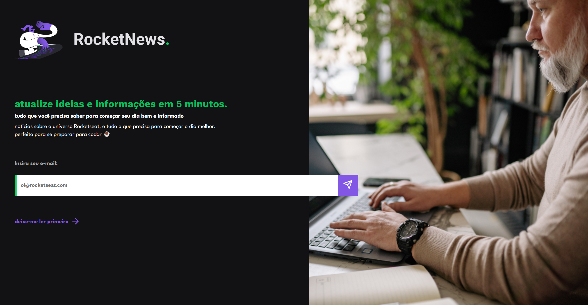

# RocketNews

## Projeto 💻
Projeto de um desafio da Rocketseat de desenvolver uma página web simples que servirá no futuro para captação de leads ou inscrição em newsletter.

## Layout 🔖
Segue abaixo o layout deste projeto:
- [Figma](https://www.figma.com/file/WfUg3p2NSvlfkLWKmPgZ6T/DD-%2F-RocketNews-(Copy)?t=1SunY75WuVfzpP5g-6)

## Instalação 🛠
Siga esses passos para instalar o repositório na sua máquina:
1. Rode `git clone https://github.com/miishiyama/RocketNews` para fazer um clone desse repositório.
2. Rode `npm i` para instalar as dependências do projeto.
3. Rode `npm start` para iniciar o servidor de desenvolvimento.
4. Entre no link que aparecer no terminal.

## Tecnologias 🚀
As tecnologias utilizadas neste projeto são:
- HTML
- CSS
- JavaScript
- DOM
- React
- React DOM
- Testing Library
- React Scripts
- Web Vitals
- Google Fonts

## Créditos ❤️
Feito por [Millene Eduarda Ishiyama](https://github.com/miishiyama/).
